<!-- Generated from mrc-ide/helios@b21815a -->

# Overview {.unnumbered}

In our [initial report](https://mrc-ide.github.io/helios/articles/blueprint.html) we introduced `helios`: an individual-based modelling framework for exploring the impact that far UVC installation could have on the transmission of respiratory infections. In a [follow-up report](https://mrc-ide.github.io/helios/articles/blueprint-july.html), we presented updates to that framework and a series of analyses evaluating the impact that the installation of far UVC in non-household settings could have on the burden of endemic respiratory pathogens. In this final report, we present updates to the framework made since the last report, and a series of analyses evaluating the impact that installation of far UVC in non-household settings could have on the burden of both epidemic and endemic respiratory pathogens.

# Summary of Key Results {#changes}

-   Far UVC deployment to cover a random 10% of total location area led to average reductions in annual infection incidence of \~9% for an endemic "Influenza-like" pathogen, and \~4% for an endemic "SARS-CoV-2-like" pathogen. Targeting far UVC to the riskiest locations increased this impact by 1.8x and 1.5x respectively.

-   In general, targeting far UVC deployment to locations based on riskiness had the highest relative impact when overall coverage of space was low. Increasing far UVC coverage led to increasing overlap of the locations covered between random and targeted strategies, and a diminished difference between the two strategies in terms of impact.

-   Far UVC deployment had a relatively higher impact on transmission for the "Influenza-like" pathogen than for the "SARS-CoV-2-like" pathogen (though impact in the latter was not negligible). This arises from the differences in their respective $R_0$ values (\~1.35 and \~2.5 respectively), and the non-linear nature by which reductions in transmission affect epidemic dynamics at different $R_0$ values.

-   Far UVC deployment to cover a random 10% of total location area led to limited reductions in epidemic final size of \~7% for an epidemic "Influenza-like" pathogen, and \~1% for an epidemic "SARS-CoV-2-like" pathogen. More substantial (and benefical) changes were observed in other epidemic-relevant metrics such as the height and timing of the epidemic peak, though the size of these effects at 10% coverage were still modest.

# Model Changes

Two updates to the model have been made since the last report. These are:

1.  Explicitly representing the physical area of the locations we are modelling (rather than just the number of people each location hosts). (Section \@ref(square-footage))
2.  Adding in the option to assign far UVC to the riskiest locations (rather than assigning it to locations at random, independently of riskiness). (Section \@ref(riskiness-targeting))

## Explicitly representing the physical size of each location {#square-footage}

Previously, the modelling framework used the number of individuals occupying the location as a proxy for the physical size of the location. This approach makes the implicit and unrealistic assumption that all Setting Types (i.e. schools, workplaces, leisure settings and households) have the same occupant density.

In response to this, we have updated the modelling framework to include occupant densities specific to each Setting Type, with these occupant densities selected to match those used for the calculation of transmission riskiness variation described in the [previous](https://mrc-ide.github.io/helios/articles/blueprint-july.html) report, which were:

-   **Households:** 20m^2^ per person (5 people per 100m^2^, per ANSI/ASHRA Standard 62.1 Table 6.1)

-   **Workplace:** 10m^2^ per person (10 people per 100m^2^)

-   **Schools:** 3.33m^2^ per person(30 people per 100m^2^)

-   **Leisure:** 2m^2^ per person(50 people per 100m^2^)

Note that an assumption remaining here is that all Locations of a particular Setting Type (e.g. Schools) have the same assumed occupancy density. The density of occupants in Locations belonging to each Setting Type is therefore the same, but the overall area of each Location differs depending on the number of individuals who occupy that particular Location.

## Targeting far UVC to locations based on riskiness {#riskiness-targeting}

In a [previous report](https://mrc-ide.github.io/helios/articles/blueprint-july.html), we incorporated variation in riskiness between Locations belonging to the same Setting Type. This variation was estimated using empirical data on variation in ventilation rates and integrating this with a transient Wells-Riley equation. Previously, assigning far UVC to individual locations was either done randomly or targeted to the largest settings (by number of people they contain). In this update to the model, we have enabled targeting of far UVC to locations based on their riskiness.

As a reminder, here is what the distribution of riskiness across locations of the same Setting-Type looks like in our modelling framework Together, these imply an approximate "riskiness ratio" (the difference in riskiness between the 5th percentile risky and 95th percentile risky) of 2.5x for Households, 5.5x for Leisure locations, 4.75x for Schools and 6.35x for Workplaces:

(ref:riskiness-exemplar) The distribution of riskiness for the household, leisure, school, and workplace Setting Types.

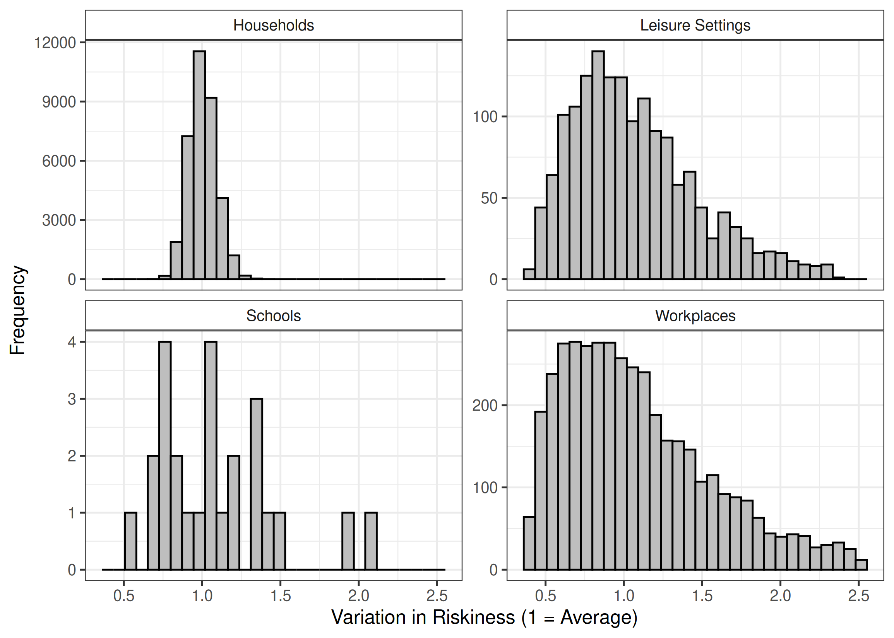

(\#fig:riskiness-exemplar)(ref:riskiness-exemplar)

We have updated the modelling framework to enable targeting the deployment of far UVC to Locations based on a ranked ordering of their riskiness. Below we show how assignment of far UVC works for the two targeting strategies considered in this report. The two strategies are "random" (far UVC assigned randomly to locations, irrespective of their riskiness) and "targeted riskiness" (far UVC assigned to locations based on the rank ordered riskiness of each setting). The results below show an example where far UVC is installed to cover 50% of total School, Workplace and Leisure location area.

(ref:riskiness-coverage-exemplar) An illustrative comparison of the random targeting and riskiness-specific targeting methods for selecting locations in which far UVC is to be deployed. The grey bars represent locations in which far UVC has not been installed, and the dark blue bars those in which it has. In the left-hand plot, far UVC is deployed, at random (i.e. irrespective of setting-specific riskiness), to a 50% of all locations, across setting types. In the right-hand plot, far UVC is deployed in the riskiest 50% of locations.

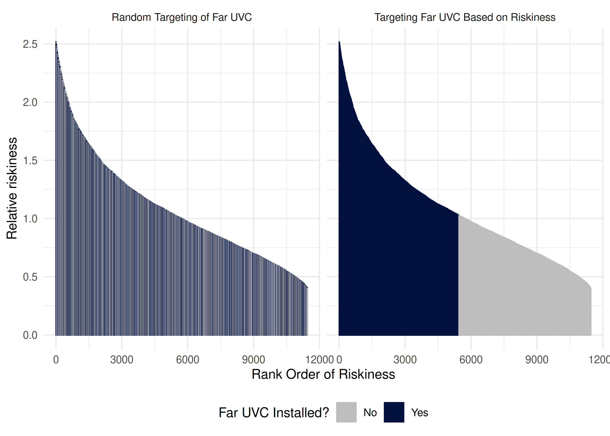

(\#fig:riskiness-coverage-exemplar)(ref:riskiness-coverage-exemplar)

# Assessing the impact of far UVC on the burden of endemic respiratory viruses {#assessing}

Using the updated modelling framework described above, we conducted analyses evaluating the potential impact of far UVC deployment on the transmission and disease burden of a hypothetical respiratory virus. We considered two pathogen archetypes (described in detail below) and present analyses for both an endemic pathogen (i.e. one which is consistently present in a population and which persists at a particular baseline prevalence of "endemicity") and an epidemic one (i.e. a pathogen which is previously not present in the population, and which emerges to cause an epidemic).

## Methods

Here, we provide a (very) brief summary of the way in which we generated the results presented in the remainder of this report. For both endemic and epidemic pathogen archetypes, we run the `helios` model with a range of parameter combinations varying far UVC coverage, far UVC efficacy, how the far UVC is deployed (at random or targeted at the riskiest locations), and for two pathogen archetypes:

-   **"SARS-CoV-2-Like" Archetype** - $R_0$ of 2.5, a mean latent period of 2 days, a mean duration of infectiousness of 4 days.

-   **"Influenza-Like" Archetype** - $R_0$ of 1.5, a mean latent period of 1 day, a mean duration of infectiousness of 2 days.

We also varied our assumption about whether the pathogen was "endemic" or "epidemic". For the epidemic pathogen, we assume that immunity arising from infection lasts for an individual's lifetime. Endemicity arises (in part) due to the finite nature of immunity arising from infection with a pathogen. For the endemic pathogen, we therefore assume a mean duration of immunity of 365 days. This gives an approximate infection prevalence of 1% for SARS-CoV-2 (i.e. approximately 1 in 100 individuals are infected at any given timepoint) and 0.3% for influenza (i.e. 1 in 330 individuals infected at any given timepoint). For each pathogen archetype, we investigated the effect of far UVC efficacy and far UVC coverage on the annual incidence of infection, varying:

-   **far UVC Coverage:** Between 0% and 80%, in increments of 10%. In all cases, far UVC was assumed to be installed in schools, workplaces and leisure locations only (i.e. not households), either at a random set of locations or based on their riskiness.

-   **far UVC Efficacy:** Either 40%, 60% or 80%, with the assumption that far UVC efficacy was identical across all Settings and Locations where it had been installed.

All presented results are based on summary statistics (e.g. mean, range etc) calculated from 25 stochastic replicates for each parameter combination.

For the endemic pathogen, we used the reduction in annual infection incidence to summarise far UVC impact. Figure \@ref(fig:methods-figure-endemic) shows how this reduction in annual infection incidence was calculated. We ran the model for a period of time without far UVC (referred to in the figure as the "pre-UVC" period), and calculated the average annual incidence of infection over this period. We then introduced far-UVC at a certain point and ran the model for a further 10 years (referred to in the figure as "post-UVC"). We then calculated the average annual incidence of infection across this decade, and the difference in annual incidence of infection between the "pre-UVC" and "post-UVC" periods.

For the epidemic pathogen, we considered 3 metrics that together summarise far UVC impact. These are the final epidemic size (the total number of individuals infected during the epidemic as a percentage of total population size), the timing of the epidemic peak, and the size of the peak (the number of individuals infected when the epidemic is at its largest) as a percentage of the total population size. For each metric, we ran separate scenarios with and without far UVC installed, and then compared each of the metrics. Figure \@ref(fig:methods-figure-epidemic) shows the basis for how we calculated the different metrics used to asses far UVC impact in an epidemic pathogen scenario.

(ref:methods-figure-endemic) Calculation of the average reduction in annual infection incidence for the endemic pathogen scenarios. Grey colouring indicates pre-UVC period, and orange colouring indicates period following introduction of far UVC. Far UVC is installed at year 5 in this exemplar scenario (indicated by vertical dashed line). Horizontal dashed lines indicate the average incidence of infection in the pre and post UVC periods. Solid arrow indicates the difference in infection incidence between pre-UVC and post-UVC periods. Top panel shows daily incidence, bottom panel shows annual incidence.

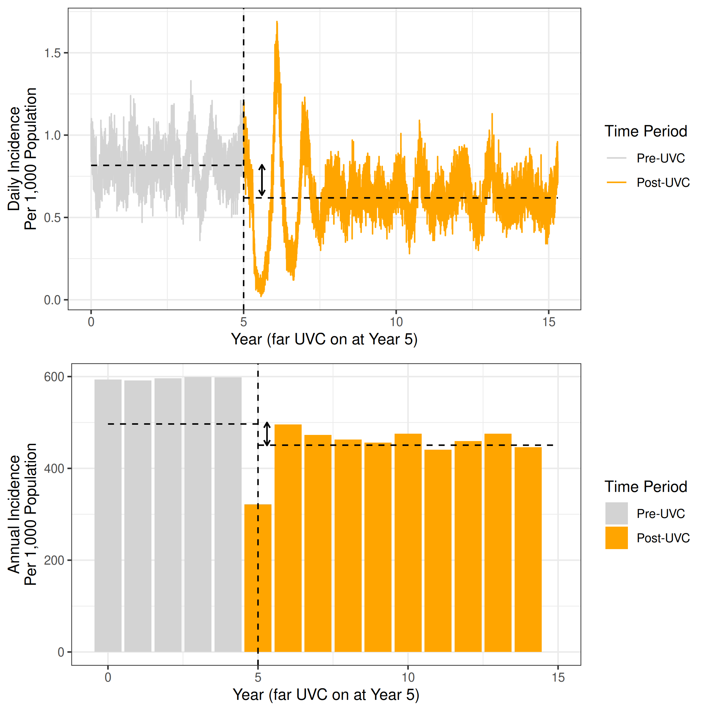

(\#fig:methods-figure-endemic)(ref:methods-figure-endemic)

(ref:methods-figure-epidemic) Calculation of the metrics summarising far UVC impact for for the epidemic pathogen scenarios. Grey colouring indicates the scenario with far UVC installed, and orange colouring indicates the scenario with far UVC. Solid arrow indicates the difference in epidemic peak size (vertical arrow) and timing (horizontal) arrow, which were used to summarise impact.

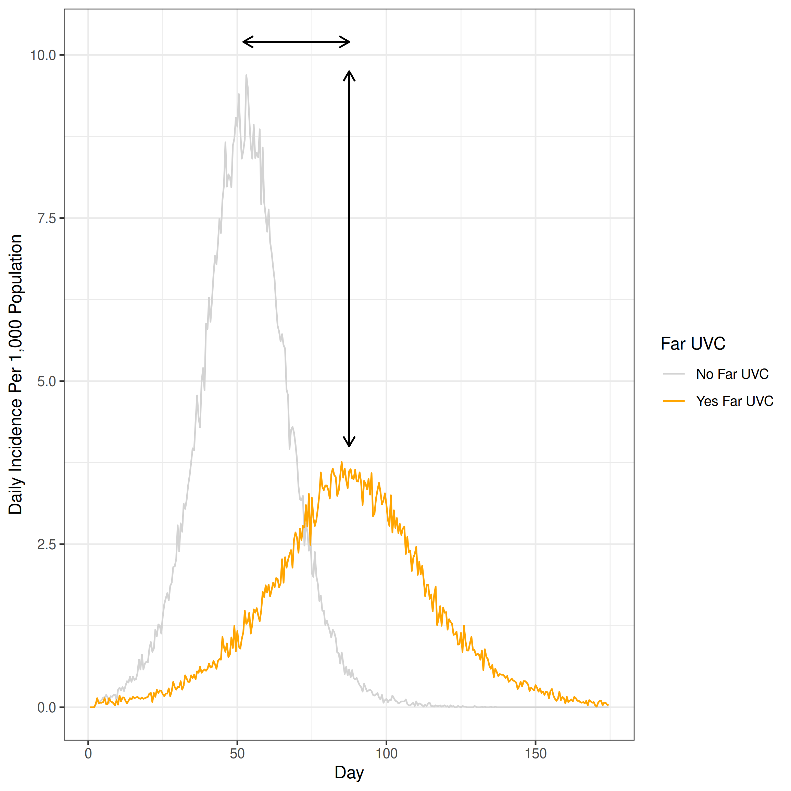

(\#fig:methods-figure-epidemic)(ref:methods-figure-epidemic)

## Results

### Epidemic Pathogen Analyses

The results of analyses examining the impact of far UVC installation on an epidemic pathogen are presented in Figure \@ref(fig:epidemic-peak-size) (epidemic peak size), Figure \@ref(fig:epidemic-peak-timing) (epidemic peak timing), and Figure \@ref(fig:epidemic-final-size) (epidemic final size).

<!-- We consider three metrics to evaluate the impact of far UVC in the case of an epidemic pathogen. The first is the number of infected individuals at the peak of transmission as a percentage of the total population (hereafter referred to as "peak size", see Figure @ref(fig:epidemic-peak-size)); the second is the timing of this peak (hereafter referred to as "peak timing"), see Figure @ref(fig:epidemic-peak-timing); and the third is the total number of individuals, as a percentage of the total population, infected over the course of the epidemic (hereafter referred to as "final epidemic size", see Figure @ref(fig:epidemic-final-size). -->

#### Epidemic Peak Size

Figure \@ref(fig:epidemic-peak-size) shows the impact of far UVC deployment on the peak size of the simulated epidemic. Across all far UVC coverages, efficacies, and archetypes simulated, targeting far UVC deployment at the riskiest locations provided greater reductions in the peak epidemic size than random allocation. Increasing far UVC coverage led to progressively greater reductions in peak size, with a larger (proportional) impact on disease burden observed for an "influenza-like" pathogen than a "SARS-CoV-2-like" pathogen. Under some scenarios (e.g. $\geq$ 60% coverage and $\geq$ 80% efficacy, coverage targeted at riskiest settings), far UVC installation was sufficient to prevent the epidemic occurring entirely. While far UVC deployment failed to prevent an epidemic for the "SARS-CoV-2-Like" pathogen at even the highest coverage and efficacy combinations simulated, the targeted deployment of far UVC reduced the peak epidemic size up to \~60%.

Assuming 10% coverage and 60% efficacy, for the "Influenza-Like" archetype, random far UVC installation led to an 11.6% reduction (range 13.7%-18.0%) in the epidemic peak size. This corresponds to a reduction from 6.1% to 5.4% of the population infectious at the epidemic's peak. At 10% coverage and 80% assumed efficacy, the reductions in epidemic peak size was 14.0% (range 13.3%-24.3%). Targeting far UVC to the riskiest 10% of locations instead of randomly produced a 21.8% (range 19.4-25.8%) reduction in epidemic peak size when efficacy was 60%, which increased to 29.3% (range 28.7-29.5%) when efficacy was set to 80%. 

For the "SARS-CoV-2-Like" archetype, assuming 10% random coverage and 60% efficacy, there was a 4.1% reduction (range 1.9%-5.6%) in epidemic peak size, from 20.4% to 19.5% of the population infectious at the epidemic's peak. At 10% coverage and 80% assumed efficacy, the reductions in epidemic peak size was 6.8% (range 4.5%-7.5%). A10% coverage targeted far UVC strategy with 60% efficacy resulted in a 7.7% (range 6.3-8.6%) reduction, and 80% efficacy resulted in an 11.1% (range 8.6-10.3%) reduction in epidemic peak size, relative to the no-intervention baseline.

<!-- Assuming 10% coverage and 60% efficacy, random far UVC installation led to an 11.6% (range 13.7%-18.0%) reduction in the epidemic peak size (from 6.1% (5.4-7.7%) to 5.4% (4.7-6.3%)), as a percentage of the total population, for the "Influenza-Like" archetype, and 4.5% (range 1.9%-5.6%) (from 20.4% (19.3-21.3%) to 19.5% (18.9-20.2%)) for the "SARS-CoV-2-Like" archetype. At 10% coverage and 80% assumed efficacy, these are 14.0% (range 13.3%-24.3%) (from from 6.1% (5.4-7.7%) to 5.3% (4.7-5.8%)) and 6.8% (range 4.5%-7.5%) (from 20.4% (19.3-21.3%) to 19.0% (18.4-19.7%)) for the "influenza-like" and "SARS-CoV-2-like" pathogens respectively. For the "influenza-like" pathogen, targeting 60% efficacious far UVC at the riskiest 10% of locations produced a 21.8% (range 19.4-25.8%) (from (from 6.1% (5.4-7.7%) to 4.8% (4.4-5.7%)) reduction in epidemic peak size, which increased to 29.3% (range 28.7-29.5%) (from 6.1% (5.4-7.7%) to 4.3% (3.9-5.4%)) when efficacy was set to 80%. For the "SARS-CoV-2-like" pathogen, a 10% targeted far UVC strategy with 60% efficacy resulted in a 7.7% (range 6.3-8.6%) (from 20.4% (19.3-21.3%) to 18.8% (18.1-19.5%)) and 11.1% (range 8.6-10.3%) (from 20.4% (19.3-21.3%) to 18.1 (17.6-19.1%)) reduction in epidemic peak size respectively, relative to the no-intervention baseline. -->

<!-- For the "influenza-like" pathogen and random coverage, increasing far UVC coverage from 10% to 70% and the efficacy from 40% to 80% reduced the mean peak epidemic size by 53.7% (55.8-51.4%). For the "SARS-CoV-2-like" pathogen, doubling the efficacy from 40% to 80% and increasing the coverage from 10% to 70% decreased the peak size by 53.7% (51.4-55.8%) for random coverage and by 67.8% (66.5-69.6%) for targeted coverage. -->

<!-- For the "influenza-like" pathogen and random coverage, increasing far UVC coverage from 10% to 70% and the efficacy from 40% to 80% reduced the mean peak epidemic size by 53.7% (55.8-51.4%) (5.5% (4.8-6.1%) to 0.65% (0.24-1.1%)), while targeting coverage at the riskiest locations decreased the mean peak size by 99.1% (98.8-99.1%) (5.2% (4.8-5.7%) to 0.48% (0.44-0.71%)) for the same parameters. For the "SARS-CoV-2-like" pathogen, doubling the efficacy from 40% to 80% and increasing the coverage from 10% to 70% decreased the peak size by 53.7% (51.4-55.8%) (19.7% (18.8-21.0%) to 9.1 (8.3-10.2%)) for random coverage and by 67.8% (66.5-69.6%) (19.5% (18.7-20.6%) to 6.3 (5.6-6.8%)) for targeted coverage. -->

(ref:epidemic-peak-size) The impact of far UVC coverage type, coverage, and efficacy on the mean final epidemic size per 1000 individuals, defined as the maximum total number of recovered individuals in the population averaged across 25 stochastic model simulations, for influenza-like and SARs-CoV-2-like pathogens. The light blue lines represent simulations where was far UVC deployed at random, and the dark blue lines simulations where far UVC was targeted at the riskiest settings. The ribbons show minimum and maximum values across 25 stochastic replicates for each parameter set.

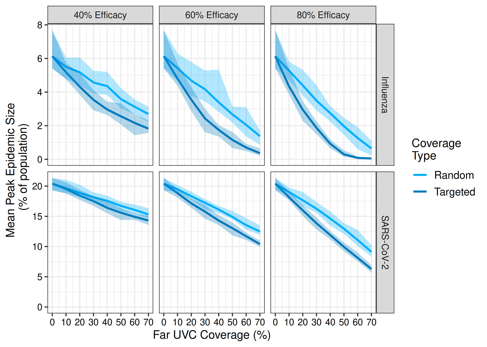

(\#fig:epidemic-peak-size)(ref:epidemic-peak-size)

#### Epidemic Peak Timing

Figure \@ref(fig:epidemic-peak-timing) shows the impact of far UVC deployment on the timing of the epidemic peak. The deployment of far UVC increased the time taken for the epidemic peak timing for both the "influenza-like" and the "SARS-CoV-2-like" pathogens. For 10% coverage and 60% efficacy, random far UVC installation led to the epidemic peak occurring 5% later (corresponding to an average delay of 6 days) for the "influenza-like" archetype when compared to the no far UVC scenario, while targeting far UVC caused the peak to occur 13% later (an average delay of 16 days). 

For the "SARS-CoV-2-like" pathogen, 10% far UVC coverage with 60% efficacy delayed the epidemic peak by 1.8% (average delay of 2 days, range 1-4 days) and 5.7% (6 days, range 5-8 days) for the random and targeted strategies respectively, while increasing the efficacy to 80% for random and targeted far UVC led to the epidemic occurring 4.4% and 7% later respectively (corresponding to an average delay of 5 days and 8 days). Targeting far UVC coverage at the riskiest settings provided greater delays in epidemic peak timing relative to the random allocation of far UVC across all combinations of efficacy and coverage, with the difference in epidemic peak time between targeted and random coverage types increasing with both far UVC coverage and efficacy. 

<!-- Increasing targeted far UVC efficacy from 40% to 80% and the coverage from 10% to 50% for the "influenza-like" pathogen increased the peak time by 286% (range 177.9-541.6%) (138 days (131-154) to 395 days (233-834)), while increasing far UVC efficacy from 40% to 80% and the coverage from 10% to 70% increased the peak time by 181% (range 169.8-187.9%) (109 days (106-116) to 195 days (180-218)) for the SARS-CoV-2-like pathogen.  -->

(ref:epidemic-peak-timing) The impact of far UVC coverage type, coverage, and efficacy on the mean number of days until the peak of the epidemic wave (in days), defined as the average timestep on which the number of infected individuals in the population peaked across 25 stochastic simulations for each parameterisation, for influenza-like and SARs-CoV-2-like pathogens. The light blue lines represent simulations where was far UVC deployed at random across setting-types (excluding households), and the dark blue lines simulations where far UVC was targeted at the riskiest locations across all setting types (excluding households). The ribbons show minimum and maximum values across 25 stochastic replicates for each parameter set.

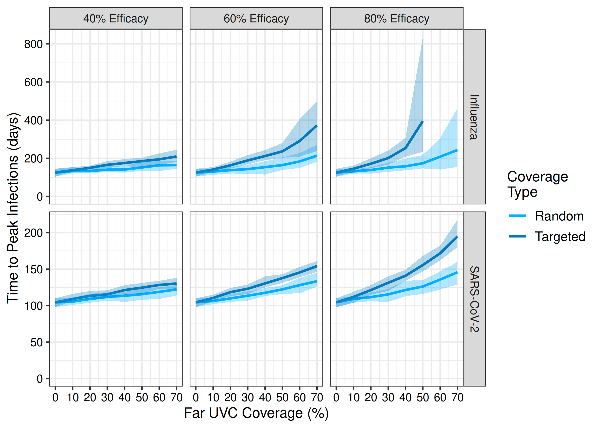

(\#fig:epidemic-peak-timing)(ref:epidemic-peak-timing)

#### Epidemic Final Size

Figure \@ref(fig:epidemic-final-size) shows the impact of far UVC deployment on the final size of the simulated epidemics. Relative to a non-intervention baseline, installing far UVC at a randomly assigned coverage of 10% and assuming 60% efficacy, far UVC reduced the epidemic final size from 61.2% to 57.9% of the population infected for the "Influenza-like" archetype. This corresponds to a 5.5% (range 5.3%-6.7%) reduction. When far UVC coverage was targeted to the riskiest locations, this reduction was 8.1% (range 6.0%-10.1%). Increasing far UVC efficacy to 80% resulted in reductions of 7.1% (range 6.1%-9.8%) and 12.6% (range 10.8%-14.7%) for random and targeted coverage respectively. For the "SARS-CoV-2-like" pathogen, installing far UVC at 10% coverage with 60% efficacy reduced the epidemic final size by 1.2% (0.8-1.1%) (from 89.6% of the population infected to 88.5%) for random coverage and 1.5% (1.1-1.8%) for targeted coverage. When efficacy was 80%, the reduction in final epidemic size increased to 2.1% (1.6-2.2%) for random coverage and 2.7% for targeted coverage. In general, the reductions in final epidemic size observed for the "SARS-CoV-2" like pathogen were more moderate than for the "influenza-like" pathogen.   

<!-- Increasing far UVC efficacy from 40% to 80% and expanding coverage from 10% to 80% decreased the mean final size by 70.5% (62.3-81.2%) (from 58.6% (56.0-60.7%) to 17.3% (10.5-22.9%)) when far UVC was deployed randomly against an "influenza-like" pathogen, and by 98.9% (97.2-99.6%) (from 58.1% (56.3-59.9%) to 0.59% (0.240-1.67%)) when targeted against the riskiest locations. Similarly, for the "SARS-CoV-2-like pathogen, the mean final size was reduced by 22.7% (20.9-24.7%) (88.9% (88.3-89.7%) to 68.7% (66.5-70.9%)) when efficacy was increased from 40% to 80% and coverage from 10% to 70% under random coverage and by 29.3% (27.5-30.2%) (88.9% (88.3-89.8%) to 62.9% (61.6%-65.1%)) under targeted far UVC. For the "influenza-like" pathogen, far UVC deployment provided substantial reductions in the final epidemic size.  -->

(ref:epidemic-final-size) The impact of far UVC coverage type, coverage, and efficacy on the mean final epidemic size per 1000 individuals, defined as the average maximum total number of recovered individuals in the population across 25 stochastic simulation runs for each parameterisation, for influenza-like and SARs-CoV-2-like pathogens. The light blue lines represent simulations where was far UVC deployed at random, and the dark blue lines simulations where far UVC was targeted at the riskiest settings. The ribbons show minimum and maximum values across 25 stochastic replicates for each parameter set.

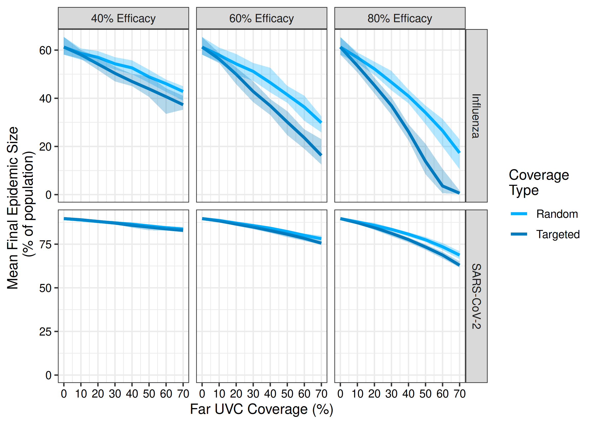

(\#fig:epidemic-final-size)(ref:epidemic-final-size)

### Endemic Pathogen Analyses

The results of analyses examining the impact of far UVC installation on an epidemic pathogen are presented in Figure \@ref(fig:endemic-impact). We consider a single metric for evaluating the impact of far UVC on the endemic pathogen. This is the total estimated annual incidence of new infections with the pathogen.

We estimate that far UVC installation would have a larger (proportional) impact on disease burden for an "Influenza-like" pathogen than a "SARS-CoV-2-like" pathogen. Assuming 10% coverage and 80% efficacy, random far UVC installation led to an 8.8% (range 6.1%-12.1%) reduction in annual infection incidence for the "Influenza-Like" pathogen, while targeting far UVC to locations in order of riskiness increased the reduction in transmission to 15.8% on average (range 12.5%-19.7%), an approximately 1.8x increase in impact. For the "SARS-CoV-2-like" pathogen, random far UVC coverage assuming 10% coverage and 80% efficacy were associated with a 3.7% (range 2.6%-4.8%) reduction in the annual incidence of infection. Targeting far UVC to locations in order of riskiness led to a 5.5% average reduction, a 1.5x increase compared to the randomly targeted scenario.

Our results also highlight that increasing far UVC coverage and/or increasing far UVC efficacy leads to increased impact, though the degree to which this is the case varies across pathogen archetypes. For the "Influenza-like" pathogen, when efficacy is 80%, increasing far UVC coverage from 10% to 30% led to the average annual reduction in incidence increasing from 8.8% to 26.3%, a 3x increase. For the "SARS-CoV-2-like" pathogen, increasing far UVC coverage from 10% to 30% led to the average annual reduction in incidence increasing from 3.7% to 9.8%, a 2.65x increase.

(ref:endemic-impact) The impact of far UVC coverage type, coverage, and efficacy on the reduction in average annual incidence of infection compared to situations where far UVC is not installed. The light blue bars represent the average for simulations where was far UVC deployed at random, and the dark blue bars stacked on top represent the average extra impact that arises when far UVC was targeted at the riskiest settings. The error bars for both show the minimum and maximum values across 25 stochastic replicates for each parameter set.

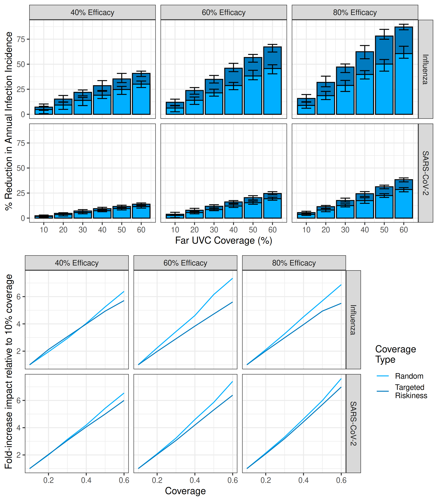

(\#fig:endemic-impact)(ref:endemic-impact)

In Figure \@ref(fig:endemic-figure2), we show the relative extra impact achieved under each scenario by targeting far UVC to locations based on riskiness, rather than at random. In general, the relative gain in transmission reduction was greatest at low coverage - when only a small fraction of locations are covered, choosing to cover those that are most conducive to transmission has a substantial (relative) effect. As the percentage of locations covered increases, the random and targeted approaches become increasingly similar (when 100% of locations are covered, they are identical), and so the relative difference in impact decreases.

(ref:endemic-figure2) The relative extra impact of far UVC coverage targeted based on riskiness compared to targeting at random. The error bars for both show the inter-quartile range across 25 stochastic replicates for each parameter set.

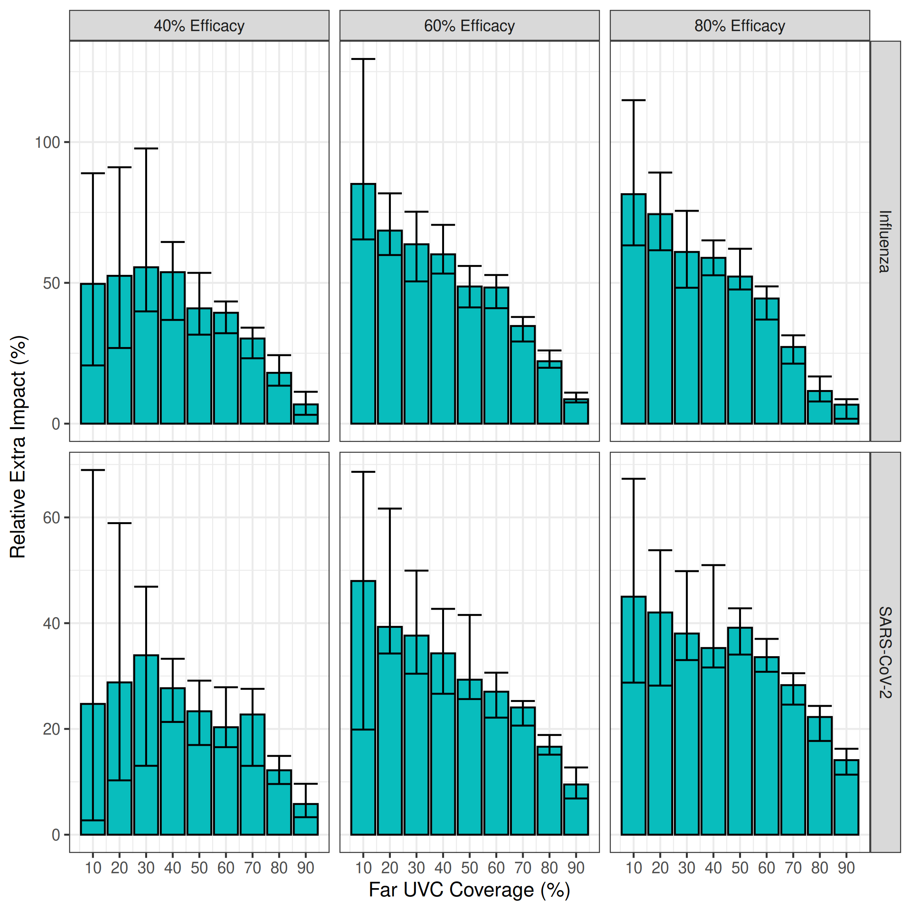

(\#fig:endemic-figure2)(ref:endemic-figure2)

### Comparison to simple multiplicative model

We next compared these results to those produced by a simplistic, static multiplicative model of estimated impact calculated by multiplying the coverage and efficacy of the modelled far UVC together and then multiplying this by the proportion of transmission that is "targetable" by far UVC (i.e. the proportion of transmission that occurs outside households). The implicit assumption of this simple multiplication is that for every 1% of targetable transmission "covered", there is a 1% reduction in transmission. The results of this analyses are plotted below in Figure \@ref(fig:comparison-1), which demonstrates that the simplified model provides similar estimates to those generated by `helios` for SARS-CoV-2, but significantly underestimates the impact for Influenza.

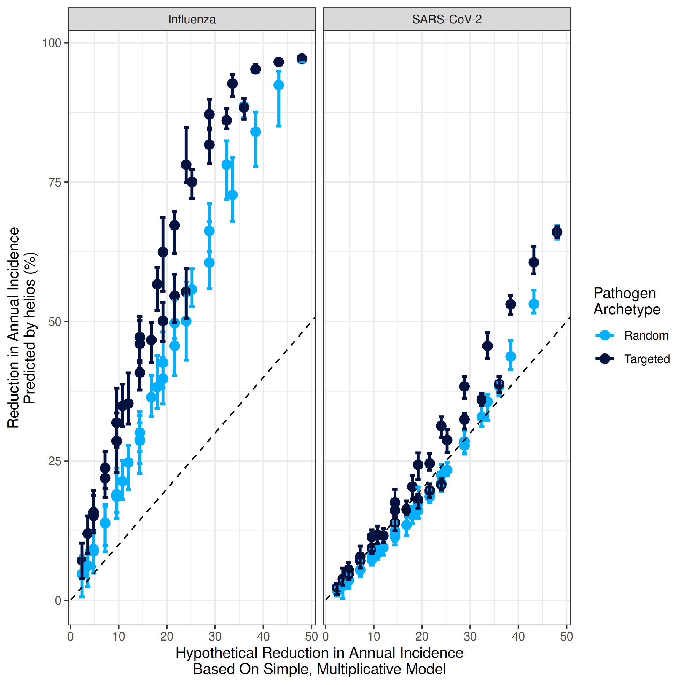

(\#fig:comparison-1)(ref:comparison-1)

(ref:comparison-1) Comparing the estimates of impact for `helios` and a simplified multiplicative model. x-axis indicates the reduction estimated by the simple model; y-axis the estimate produced by `helios` . Points are coloured according to pathogen archetype. Dashed line indicates the line of `y = x` (i.e. any points lying on that line have the same impact estimate from `helios` and the simplified model). Grey shaded area indicates range where the simple model predicts lower impact than `helios`.

Below in Figure \@ref(fig:comparison-2) we plot the epidemiological value of an averted infection (defined here as the `helios` modelled reduction in annual incidence divided by the reduction in incidence predicted by that simple multiplicative model) against the percentage of transmission predicted to remain in the simple multiplicative model (i.e. 100% - the predicted % decrease in transmission from the simple model). We do so to explore and estimate the overall epidemiological value of far UVC averting a single transmission event. This therefore takes into account two opposing forces - firstly, that the individuals far UVC protects during a potential transmission event go on to be infected by other sources (which will decrease the total number of averted infections to be less than 1), and the number of individuals that otherwise averted infection would have  gone on to infect (which will increase the total number of averted infections to be greater than 1). 

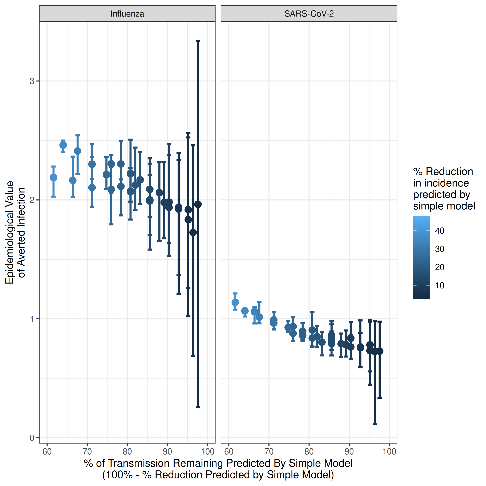

(\#fig:comparison-2)(ref:comparison-2)

(ref:comparison-2) Estimating the epidemiological value of an averted infection in each of the scenarios considered. Each dot is a model run (i.e. a particular scenario combination of coverage, UVC efficacy etc). The x-axis indicates the percentage of transmission predicted to remain in the simple multiplicative model after applying the impacts of UVC coverage and efficacy (i.e. 100% - the predicted % decrease in transmission from far UVC in the simple model). The y-axis indicates the epidemiological value of an averted infection, i.e. the total number of infections that are averted as a result of far UVC directly averting one transmission event. Results plotted are for the random coverage scenario only.

# Discussion

Our results highlight the impact that the deployment of far UVC could have in reducing disease transmission across a range of pathogen archetypes and disease metrics. Targeting the deployment of far UVC towards the riskiest locations provided additional reductions in epidemic size and intensity or endemic burden, but appreciable reductions were still observed when far UVC was installed at random and reductions in performance relative to targeted deployment could generally be overcome with increased efficacy and coverage. Far UVC deployment typically had a greater relative impact on the control of an "Influenza-like" pathogen than the "SARS-CoV-2-like" pathogen considered in our analyses.

For the "Influenza-like" pathogen archetype (approximate $R_0$ of 1.35), targeted installation of far UVC at very high coverage and efficacy ($\geq$ 80%) achieved complete suppression in the epidemic instance (i.e. reduced R \< 1 and prevented the pathogen from spreading from low initial frequency). This was not achieved under any circumstances for the "SARS-CoV-2-like" pathogen archetype (approximate $R_0$ of 2.5). However, far UVC provided significant value in the epidemic scenarios even when it did not achieve complete suppression of the epidemic, as measured by the range of metrics considered in this report. Reductions in transmission that fall short of full suppression arising from far UVC could still reduce the associated pressure on healthcare systems by reducing the peak size (and therefore burden) on the healthcare system, and spreading that burden out over time - the so-called "flattening of the curve". Delaying the epidemic peak also provides more time for other medical countermeasures, such as vaccines, to be developed. Furthermore, for the same disease burden, flattening the curve enables shorter and less stringent non-pharmaceutical interventions to be implemented relative to scenarios in which far UVC is not available. An important point to note however is that the impact of far UVC at 10% coverage and 60 or 80% efficacy on epidemic metrics was typically quite modest, with appreciable delays to epidemic timing or reductions in epidemic final size/peak size occurring when coverage was substantially higher. 

In the context of an endemic pathogen, installation of far UVC to a random 10% of location space led to average reductions of approximately 9% and 4% in annual incidence of infection for the "Influenza-like" and "SARS-CoV-2-like" archetypes respectively. Given the scale of the burden associated with endemic respiratory pathogens (with many individuals infected at a cadence of ~once a year or more frequently), such modest reductions translate into large numbers of averted infections. The differences in the reductions observed between the archetypes is primarily driven by differences in the $R_0$ of each (\~1.35 for "Influenza-like" and \~2.5 for "SARS-CoV-2-like"). In general, there is a non-linear influence of $R_{0}$ on the final size of an epidemic (for an epidemic pathogen) and the average prevalence of infection (in the case of an persistently endemic pathogen). For lower values of $R_{0}$ which are near to the critical threshold of $R_0=1$, small increases to $R_0$ translate to (relatively) large increases in the above quantities (e.g. $R_0=1$ yields a final size of 0%; $R_0=1.25$ a final size of \~35%). At higher values of $R_{0}$ however, saturation occurs (e.g. the final size of an epidemic with robust and sterilizing immunity post infection can never be \>100%) and the rate at which increasing values of $R_0$ increases infection prevalence or epidemic final size diminishes (e.g $R_0=2$ yields a final size of \~80%; $R_0=2.25$ a final size of \~85%, $R_0=4$ a final size of \~95%). By the same logic, when the starting $R_0$ is high (as for the "SARS-CoV-2-like" archetype), small reductions in $R_0$ (e.g. due to far UVC) will have only a slight impact on infection prevalence or epidemic final size. By contrast, when baseline $R_0$ is lower (as for the "Influenza-like" archetype"), the infection prevalence (or final epidemic size) will decrease more (in relative terms) for the same (relative) reduction in $R_0$.

Our results also highlight that the added value of targeting far UVC coverage based on riskiness (rather than at random) is greatest when the total percentage of covered space is low (e.g. 10% considered in the analyses presented in this report). As the proportion of space covered increases, there is increasing convergence between the two strategies (as a greater number of total spaces are covered). At 100% coverage, the two strategies are identical. Our results suggest that in instances where only a low fraction of spaces are likely to be covered (for instance during initial adoption of the technology), the value of information that enables installation to be targeted at the riskiest spaces is likely to be substantial.
