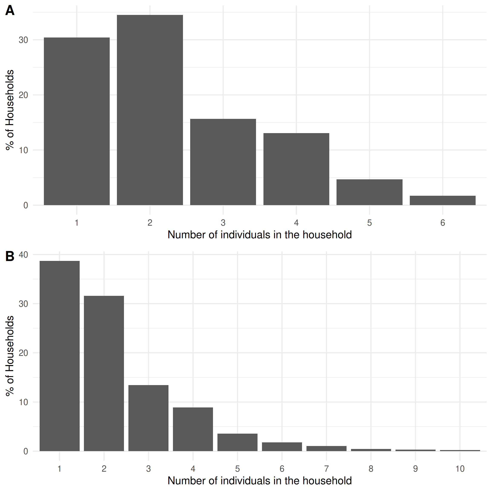
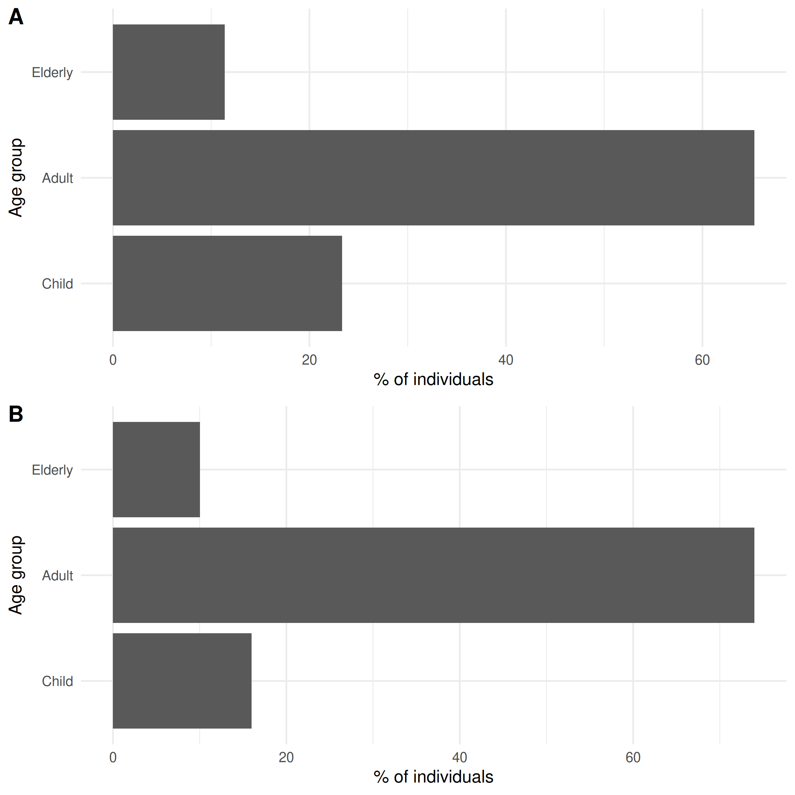
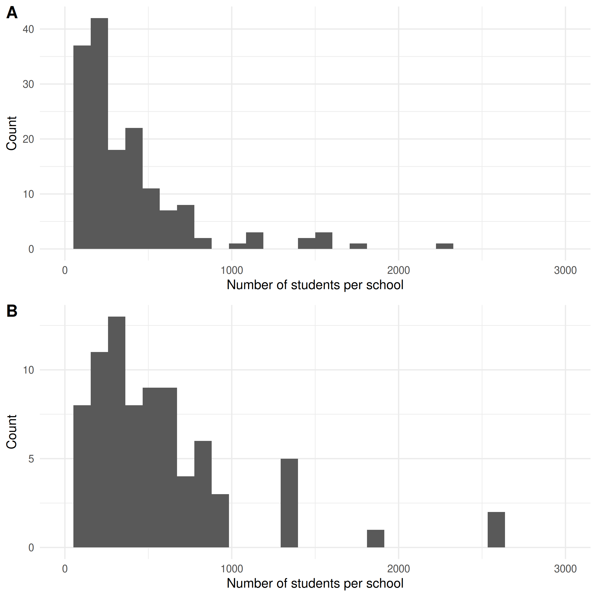
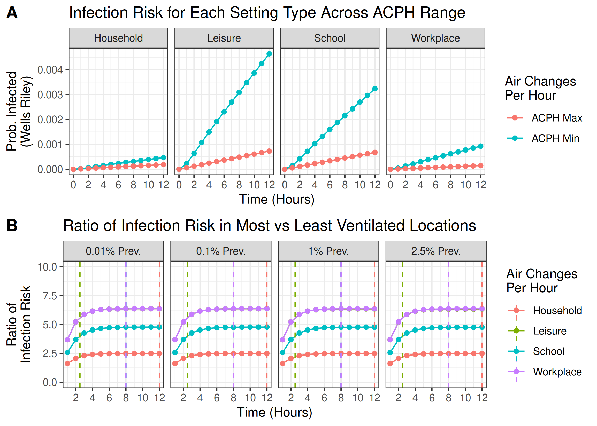
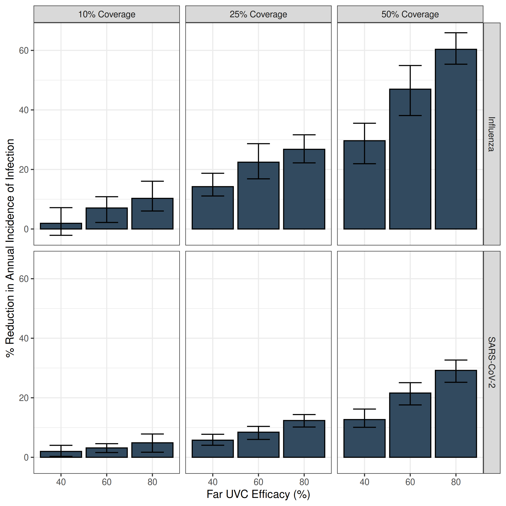
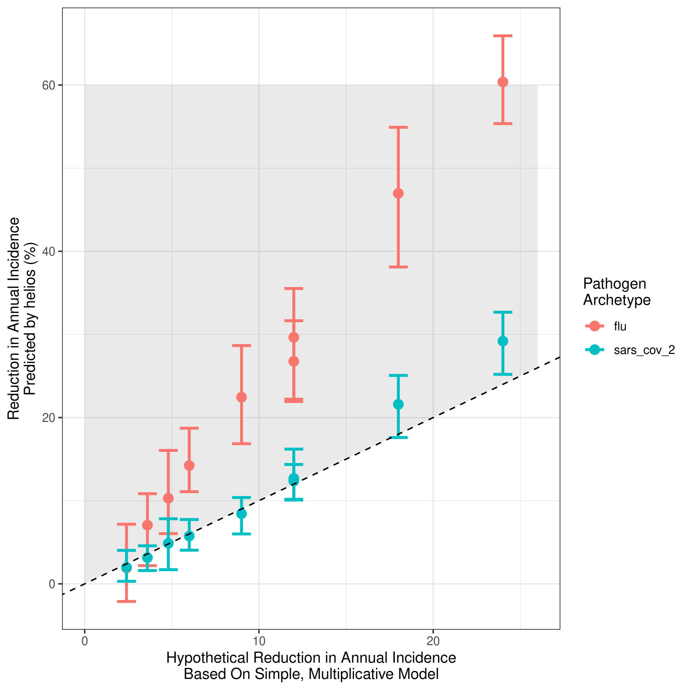
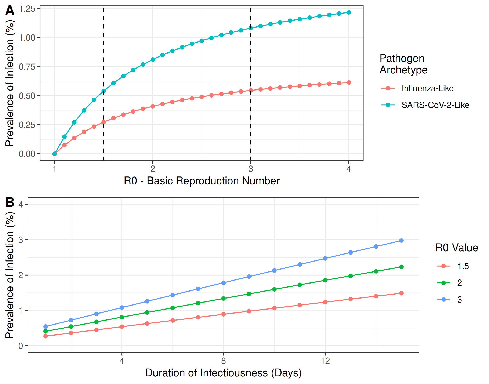

<!-- Generated from mrc-ide/helios@b21815a -->

# Overview {.unnumbered}

In our [initial report](https://mrc-ide.github.io/helios/articles/blueprint.html) we introduced `helios`: an individual-based modelling framework for exploring the impact that installation of far UVC could have on the transmission and burden of respiratory infections. This report describes updates made to the modelling framework since that initial report (Section \@ref(changes)). Additionally, we present a series of analyses evaluating the impact that installation of far UVC in non-household settings could have on the burden of endemic respiratory pathogens, using "influenza-like" and "SARS-CoV-2-like" pathogen archetypes as case studies. (Section \@ref(assessing)).

# Major Model Changes {#changes}

Two major updates to the model have been made since the initial report. These are:

1.  Using data from the United States of America (USA) to parameterise all aspects of the model's representation of the physical environment (Section \@ref(usa-data)).
2.  Including variation in the propensity for infectious disease transmission (which we call "riskiness") across individual locations in the model (Section \@ref(location)).

## Use of Data from the USA {#usa-data}

Previously, we used data both from the United Kingdom (UK) and from the USA. In particular, we used data from the UK to parameterise the age distribution, household and school Setting Types; and data from the USA to parameterise the workplace Setting Type. In this update to the model, we parameterise the age distribution, household and school Setting Types using data only from the USA.

### Household Setting Type & Age Distribution

To parameterise the model's household size and age distribution we use data from a synthetic USA population developed by RTI International for the purposes of disease modelling [@wheaton2014us]. This dataset is synthetic, but was developed by calibrating to datasources from the USA - it is therefore a virtual, anonymised population that is representative of the USA. It contains individual-level information on household residency and age, which we use to construct the household Setting Type and age distribution used in the results presented here. State and county specific data are available. We selected data from San Francisco, California.

**Figure** \@ref(fig:household-size)**A** shows the previous household size distribution used (based on UK data); **Figure** \@ref(fig:household-size)**B** shows the household size distribution now being used (based on the USA data described above). Figure \@ref(fig:age) shows the same but for the age distribution used.

(ref:household-size) A distribution of household sizes for a synthetic population of size 250,000 using data from the UK (A) and from the USA (B).

(\#fig:household-size)(ref:household-size)

(ref:age) An age group population sizes distribution for a synthetic population of size 250,000 using data from the UK (A) and from the USA (B).

(\#fig:age)(ref:age)

### School Setting Type

To parameterise the model's schools sizes, we used US school size data from 2019-2020 from the National Center for Education Statistics, available from @deBrey2023Digest. We included all schools categorised as "prekindergarten", "elementary", "middle", or "secondary and high". As school sizes were provided in ranges (e.g. "500 to 599") we used the midpoint (e.g. 550) for the purposes of constructing the distribution of schools sizes (this is in contrast to the UK data where exact school sizes were available). This data was available only at the national level, which we use here.

**Figure** \@ref(fig:school-size)**A** shows, for a population of 250,000, the resulting school size distribution used based on previous data which was from the UK; **Figure** \@ref(fig:school-size)**B** shows the household size distribution now being used, which is based on the USA data described above.

(ref:school-size) A distribution of school sizes for a synthetic population of size 2.5\times 10^{5} using data from the UK (A) and from the USA (B). As the UK has a higher proportion of children, the total school occupancy in the UK is higher than in the US.

(\#fig:school-size)(ref:school-size)

## Location-Specific Variability in "Riskiness" {#location}

Previously, we modelled differences in "riskiness" (i.e. how conducive to transmission it is) between different Setting Types (schools, workplaces, leisure settings and households). However, we made the simplifying assumption that all Locations within a particular Setting Type (e.g. individual schools) had the same riskiness. We now explicitly incorporate variation in riskiness between Locations belonging to the same Setting Type. Below is a mathematical description of this addition and the parameterisation used for the results presented in this report.

### Modelling Variation in Transmission Riskiness Between Locations of the Same Setting Type

Previously, we modelled the force of infection experienced by individual $i$ in Location $m$ at time $t$ as follows: $$
\lambda_{i,j,m}(t) = \frac{\beta_{m} I_{j,m}(t)}{N_{j,m}}
$$ where $I_m(t)$ are the number of infectious individuals in Location $j$ of Setting Type $m$ at time $t$ , $N_{j,m}$ is the total number of individuals visiting Location $j$ of Setting Type $m$ at time $t$ and $\beta_m$ is a Setting Type-specific (i.e. workplace, school, household, leisure-venue specific) transmissibility parameter that models **on average** how much transmission happens in a particular Setting Type (e.g. workplaces) compared to other Settings Types (e.g. schools). The total force of infection $\lambda_T$ experienced across all Setting Types is then summed and forms the basis for calculating an individual's probability of infection during one time-step $t$: $$
P(infection) = 1 - e^{- \lambda_{i,T}t}.
$$

Previously, $\beta$ was specific to the Setting Type (i.e. it was different for schools, workplaces, households and leisure settings) but assumed to be the same same for every location of that setting type e.g. all schools had the same $\beta$. We have now relaxed this assumption. The updated force of infection term is:

$$
\lambda_{i,j,m}(t) = \frac{\beta_{j,m} I_{j,m}(t)}{N_{j,m}}
$$

where:\
$$
\beta_{j,m} = \gamma_{j,m}\beta_{m}
$$ and: $$
\gamma_{j,m} \sim Lognormal(\mu_{m}, \sigma_{m}).
$$ The parameter $\gamma$ controls how risky a particular Location of a specific Setting Type is relative to the **average** for that Setting Type and is drawn from a Lognormal distribution. For example, $\gamma = 1$ is a setting which is as "risky" as the average location of that Setting Type. Meanwhile, $\gamma = 2$ would describe a setting that is twice as risky; $\gamma = 0.5$ would describe a setting that is half as risky etc. Parameterisation and estimation of $\gamma$ is described below.

### Parameterising $\gamma$ and Estimating Variation in Transmission Riskiness Across Locations of the Same Setting Type

To estimate $\gamma$, we combined a mathematical model of indoor air quality (as applied to infective virus concentrations) with a well-studied airborne infectious risk model (the Wells-Riley equation). We then parameterised these models with literature-derived estimates of:

1.  Virus-specific parameters (with SARS-CoV-2 chosen as a case study),
2.  Variation in ventilation rates across Locations belonging to the same Setting Type.

Together, these enable us to produce estimates of the variation in riskiness for SARS-CoV-2 transmission between different Locations belonging to the same Setting Type. Below we describe this process.

#### Step 1: Modelling the Concentration of Infective Virus in an Enclosed Space and Associated Infection Risk

Following the approach of [Blatchley et al, 2024](https://pubs.acs.org/doi/full/10.1021/acs.est.3c03026#), we model the concentration of a pathogen in the air in an enclosed space via the following ordinary differential equation (ODE): $$
\nu \frac{dC(t)}{dt} =  - QC - k_DC \nu + I\pi 
$$ where $v$ is the space volume, $C$ is the infective virus concentration, $t$ is time, $Q$ is the flow rate of air into and out of the space, $k_D$ is the natural decay constant, $I$ is the number of infectious individuals in the space, and $\pi$ is the per capita (infective) virus emission rate. The closed-form solution to this equation is: $$
C(t) =  \frac{I\pi}{\alpha \nu}(1 - e^{-\alpha t}) 
$$ where: $$
\alpha = \frac{Q}{\nu} + k_D
$$ $\frac{Q}{\nu}$ is the number of air changes per hour. $\alpha$ is therefore the number of equivalent air changes per hour taking into account both natural decay of the virus and ventilation-driven removal of infective virus. For the purposes of the analyses presented here, we assume the volume of the space is the following: $$
\nu = N D_mH
$$where $N$ is the number of people occupying the space, $D_m$ is the density of people in the space (i.e. the number of people per m^2^) and $H$ is the height of the space.

We then integrate this estimate of the concentration of infective virus in the space with the Wells-Riley equation, a simple and widely used model for the airbone transmission of infectious diseases. The Wells-Riley equation takes the following form: $$
P_{i}(t) =  1 - e^{-r C_{ss}Bt}
$$ where $P_i$ is the probability a person becomes infected conditional on them spending time $t$ in a space with $C_{ss}$ concentration of infective virus, $B$ is the volume rate at which air is breathed in, and $r$ is the risk parameter, the probability that a single inhaled infective virus will initiate an infection.

#### Step 2: Estimating Variation in Riskiness Across Locations of the Same Setting Type

With the modelling framework to assess risk in place, we carried out a sensitivity analysis to derive reasonable bounds for $\gamma$. We used the above equations in tandem with estimates of variation in the ventilation rates in different spaces (from [Corsi et al, 2006](https://corsiaq.com/reports-etc/) - Section 3.1) and parameter estimates for SARS-CoV-2 from Blatchley et al (see Table \@ref(tab:parameter-estimates)) to explore how Location riskiness varied whilst varying:

1.  Infection Prevalence (i.e. the number of infectious individuals in the space).
2.  Air Changes Per Hour (considering the minimum and maximum of the ranges provided in \@ref(tab:parameter-estimates))
3.  The Time Spent in the Space (ranging from 0 to 8 hours).

The results of this are shown in \@ref(fig:wells-riley-1). They show that the riskiness ratio (i.e. how much more risky the most risky setting is compared to the least risky setting) for each Setting Type is largely the same across the different modelled infection prevalences. They do however depend on the assumed time spent in the space. For the purposes of the results presented here, we assume that individuals spend the following time in each Setting Type:

-   Household: 12 hours [corresponding to a riskiness ratio of 2.5]

-   Leisure: 2.5 hours [riskiness ratio of 5.5]

-   School: 8 hours [riskiness ratio of 4.75]

-   Workplace: 8 hours [riskiness ratio of 6.35]

and 1.5 hours in the community, noting that individuals spend time in either Schools (children and teachers) or Workplaces (all other adults) but not both. We use these ratios as the basis for the Setting Type and Location specific $\gamma_{j,m}$ values used in the modelling analyses presented in the next section.

(ref:wells-riley-1) Estimating the variation in riskiness between Locations belonging to the same Setting Type. **A)** For each Setting Type, the probability of infection in the least and most risky settings (i.e. with the lowest and highest ventilation rates) over time. **B)** The ratio of infection risk in the most vs least risky Locations over time for each Setting Type. Vertical dashed lines indicate the time assumed spent in each Setting Type for purposes of modelling. Note ratios are the same for Leisure and Workplace and so only Workplace is plotted.

(\#fig:wells-riley-1)(ref:wells-riley-1)

| Parameter       | Value Used                          | Description                                                                                     | Source                                                                                                                                  |
|-----------------|-------------------------------------|-------------------------------------------------------------------------------------------------|-----------------------------------------------------------------------------------------------------------------------------------------|
| $\pi$           | 27 viruses per person per hour      | Rate of infective virus emission from infected individuals.                                     | @blatchley2023quantitative & @buonanno2020quantitative                                                                                  |
| $D_{school}$    | 30 per 100m^2^                      | Assumed density of individuals in schools                                                       | ANSI/ASHRAE Standard 62.1-2022 Table 6.1                                                                                                |
| $A_{school}$    | 0.1-2.9 air changes per hour (ACPH) | Range of ACPH considered for schools.                                                           | [Corsi et al, 2006](https://corsiaq.com/reports-etc/) - Section 3.1                                                                     |
| $D_{workplace}$ | 10 per 100m^2^                      | Assumed density of individuals in workplaces                                                    | ANSI/ASHRAE Standard 62.1-2022 Table 6.1                                                                                                |
| $A_{workplace}$ | 0.22-4.84 ACPH                      | Range of ACPH considered for workplaces.                                                        | [Corsi et al, 2006](https://corsiaq.com/reports-etc/) - Section 3.1                                                                     |
| $D_{household}$ | 5 per 100m^2^                       | Density of individuals in households                                                            | Assumed                                                                                                                                 |
| $A_{household}$ | 0.21-1.48 ACPH                      | Range of ACPH considered for households.                                                        | [Corsi et al, 2006](https://corsiaq.com/reports-etc/) - Section 3.1                                                                     |
| $D_{leisure}$   | 50 per 100m^2^                      | Density of individuals in leisure settings                                                      | ANSI/ASHRAE Standard 62.1-2022 Table 6.1                                                                                                |
| $A_{leisure}$   | 0.22-4.84 ACPH                      | Range of ACPH considered for leisure locations.                                                 | [Corsi et al, 2006](https://corsiaq.com/reports-etc/) - Section 3.1                                                                     |
| $k_D$           | 0.64                                | Natural decay constant for SARS-CoV-2 in aerosols                                               | @blatchley2023quantitative & @van2020aerosol                                                                                            |
| $H$             | 2.5m                                | Height of the space                                                                             | Assumed                                                                                                                                 |
| $B$             | 0.45 m^3^ per hour                  | Volume breathing rate assumes 15 breaths per minute and 500ml tidal volume = 0.45m^3^ per hour. | [Here](https://www.verywellhealth.com/tidal-volume-5090250#) & [here](https://my.clevelandclinic.org/health/articles/10881-vital-signs) |
| $r$             | 1.37 × 10^-2^                       | The probability that a single inhaled infective virus will initiate an infection.               | @blatchley2023quantitative & @killingley2022safety                                                                                      |

: (#tab:parameter-estimates) Parameter Estimates Used to Calculate Variation in Riskiness Across Locations Belonging to the Same Setting Type

# Assessing the impact of far UVC on the burden of endemic respiratory viruses {#assessing}

Using the modelling framework described above, we conducted analyses to evaluate the potential impact of far UVC deployment on the transmission and disease burden of a hypothetical endemic respiratory virus (i.e. one which is consistently present in a population and maintained at a particular baseline prevalence level).

## Results

We considered two pathogen archetypes for this hypothetical virus:

-   **"SARS-CoV-2-Like" Archetype** - $R_0$ of 2.5, a mean latent period of 2 days, a mean duration of infectiousness of 4 days, and a mean duration of immunity of 365 days. This gives an approximate infection prevalence of 1% (i.e. approximately 1 in 100 individuals are infected at any given timepoint).

-   **"Influenza-Like" Archetype** - $R_0$ of 1.5, a mean latent period of 1 day, a mean duration of infectiousness of 2 days, and a mean duration of immunity of 365 days. This gives an approximate infection prevalence of 0.3% (i.e. 1 in 330 individuals infected at any given timepoint).

For each pathogen archetype, we investigated the effect of far UVC efficacy and far UVC coverage on the annual incidence of infection, varying:

-   **far UVC Coverage:** Either 10%, 25% or 50% - in all cases, far UVC was assumed to be installed in schools, workplaces and leisure locations only (i.e. not households), at a random set of locations within each Setting Type.

-   **far UVC Efficacy:** Either 40%, 60% or 80%, with the assumption that far UVC efficacy was identical across all Settings and Locations where it had been installed.

The results of these analyses are presented in Figure \@ref(fig:placeholder-1). In general, we estimate that far UVC installation would have a larger (proportional) impact on disease burden for an "Influenza-Like" pathogen than a "SARS-CoV-2-Like" pathogen; and that increasing far UVC coverage and/or increasing far UVC efficacy leads to increased impact. Assuming 10% coverage and 60% efficacy, far UVC installation led to a 7% (range 2%-11%) reduction in annual infection incidence for "Influenza-Like" and 3% (range 2%-5%) for "SARS-CoV-2-Like". At 10% coverage and 80% assumed efficacy, these are 10% (range 6%-16%) and 5% (range 2%-8%) respectively.

(\#fig:placeholder-1)(ref:placeholder-1)

(ref:placeholder-1) The impact of varying far UVC coverage and efficacy on the annual incidence of a respiratory virus, for "Influenza-Like" and "SARS-CoV-2-Like" pathogen archetypes. The bars represent the mean percentage reduction in infection incidence averaged over the 10 stochastic model simulations run for each parametrisation, with the range of % reduction in incidence across those 10 simulations shown by the error bars.

The results of these analyses are presented in Figure \@ref(fig:placeholder-1). In general, we estimate that far UVC installation would have a larger (proportional) impact on disease burden for an "Influenza-Like" pathogen than a "SARS-CoV-2-Like" pathogen; and that increasing far UVC coverage and/or increasing far UVC efficacy leads to increased impact. Assuming 10% coverage and 60% efficacy, far UVC installation led to a 7% (range 2%-11%) reduction in annual infection incidence for "Influenza-Like" and 3% (range 2%-5%) for "SARS-CoV-2-Like". At 10% coverage and 80% assumed efficacy, these are 10% (range 6%-16%) and 5% (range 2%-8%) respectively.

We next compared these results to those produced by a simplistic, static multiplicative model of estimated impact calculated by multiplying the coverage and efficacy of the modelled far UVC together and then multiplying this by the proportion of transmission that is "targetable" by far UVC (i.e. the proportion of transmission that occurs outside households). The results of this analyses are plotted below in \@ref(fig:comparison-1). As you can see, this simplified model provides similar estimates to those generated by `helios` for SARS-CoV-2, but significantly underestimates the impact for Influenza.

(\#fig:comparison-1)(ref:comparison-1)

(ref:comparison-1) Comparing the estimates of impact for `helios` and a simplified multiplicative model. x-axis indicates the reduction estimated by the simple model; y-axis the estimate produced by `helios` . Points are coloured according to pathogen archetype. Dashed line indicates the line of `y = x` (i.e. any points lying on that line have the same impact estimate from `helios` and the simplified model). Grey shaded area indicates range where the simple model predicts lower impact than `helios`.

## Discussion

The observed differences in predicted far UVC impact between the two pathogen archetypes arise primarily because of their different $R_0$ values. In Figure \@ref(fig:analytical-relationship) we show the analytical relationship between $R_0$ and prevalence of infection, derived for a SEIRS compartmental model (see [here](https://www.nature.com/articles/s41592-020-0856-2) and [here](https://shiny.bcgsc.ca/posepi2/)) that shares a similar representation of a disease's natural history to `helios`. We note that the results presented in \@ref(fig:analytical-relationship) are not results from running `helios` (instead they are the analytical solution of a significantly more tractable mathematical model that is simpler than but similar to `helios`) and are displayed here solely for the purpose of illustrating a generally-held non-linearity between transmissibility ($R_{0}$) and infection prevalence.

There is a non-linear influence of $R_{0}$ on prevalence of infection (and hence disease burden). For lower values of $R_{0}$, there is a near-linear relationship between the two quantities. At higher values of $R_{0}$ however, infection prevalence saturates and the rate at which increasing values of $R_0$ increases infection prevalence diminishes. When $R_0$ is high (as for the "SARS-CoV-2-Like" archetype), small reductions in $R_0$ (e.g. due to far UVC) will have only a slight impact on infection prevalence. By contrast, when baseline $R_0$ is lower (as for the "Influenza-Like" archetype"), the infection prevalence will decrease more (in relative terms) for the same reduction in $R_0$. Increasing duration of infectiousness increases the prevalence of infection in a linear manner

(ref:analytical-relationship) The relationship between $R_0$ and the prevalence of infection at endemic equilibrium for each of the two pathogen archetypes considered here, derived mathematically for a simpler model that is similar to `helios`. The vertical dashed lines indicate the value of $R_0$ used for each archetype in the analyses carried out.

(\#fig:analytical-relationship)(ref:analytical-relationship)

# Bibliography {.unnumbered}
