<!-- Generated from mrc-ide/helios@b21815a -->

::: {.alert .alert-warning}
This report is not up to date with latest changes to the model!
:::

# Overview

The aim of this document is to introduce `helios`, an individual-based modelling framework for exploring and evaluating the potential of far UVC to control respiratory pathogens. `helios` explicitly represents the built environment and how individuals spend their time in this built environment, as well as modifications to that built environment that reduce the probability of pathogen transmission occurring (such as far UVC). The package can be used to quantify the impact of installing far UVC interventions on public health outcomes, such as infections.

# Aim of this Document

The aim of this document is to introduce you to the `helios` modelling framework and the types of results it can currently produce. Our hope is that this document will serve as a jumping off point to discuss:

1.  Any additions to the model that will be required to answer priority questions for Blueprint Biosecurity.
2.  The types of results that can be generated to answer those priority questions.

We note here that the results presented are purely **examples** of the types of results this framework can produce. Model parameterisation is underway but incomplete, and will require further time and development to get to a point where the results should be trusted.

# Model description

The model implemented in `helios` has a fixed population of individuals, who are each assigned one of three age-groups (children, adults, elderly). Each individual is therefore either a child, an adult, or an elderly person. Figure \@ref(fig:age) shows the proportion in each age group from an example population of size 200000 individuals. We do not currently explicitly model demographic changes in the model and so we assume that no aging between the age-groups (e.g. child -\> adult) occurs during the simulation.

During each day, individuals visit particular locations (Section \@ref(locations)) and mix with other individuals who are also visiting those same locations at the same time. We model 4 location types: **Households**, **Schools**, **Workplaces**, and **Leisure** **Venues**. Individuals are assigned to each location in a way that depends on their age-group (e.g. children are assigned to schools, adults are assigned to workplaces), with assignment to a **specific** location within a particular type (e.g. School #7) performed stochastically (see \@ref(locations) below).

It is during these visits to the same location that pathogen transmission can occur between two individuals - this process is stochastic and occurs only between individuals visiting the same location. See Section \@ref(disease) for further details.

## Locations {#locations}

Below we provide detail on how individuals are assigned to each Location Type.

1.  **Households:** The number of individuals in each household (Figure \@ref(fig:household-size)) and the age-composition of individuals (Figure \@ref(fig:age)) within each household are determined using data on household-age composition data from the 2011 Office for National Statistics survey in the United Kingdom (UK), following @hinch2021openabm. Specifically, we sample with replacement from this data to generate households and then populate those households with individuals. Household assignment is **static** - for each individual, the specific household they are assigned to is fixed and does not change across the course of a single simulation. They stay in the same household each day.

(ref:household-size) The distribution of household sizes. Households with two individuals are the most common, followed by single individual households.

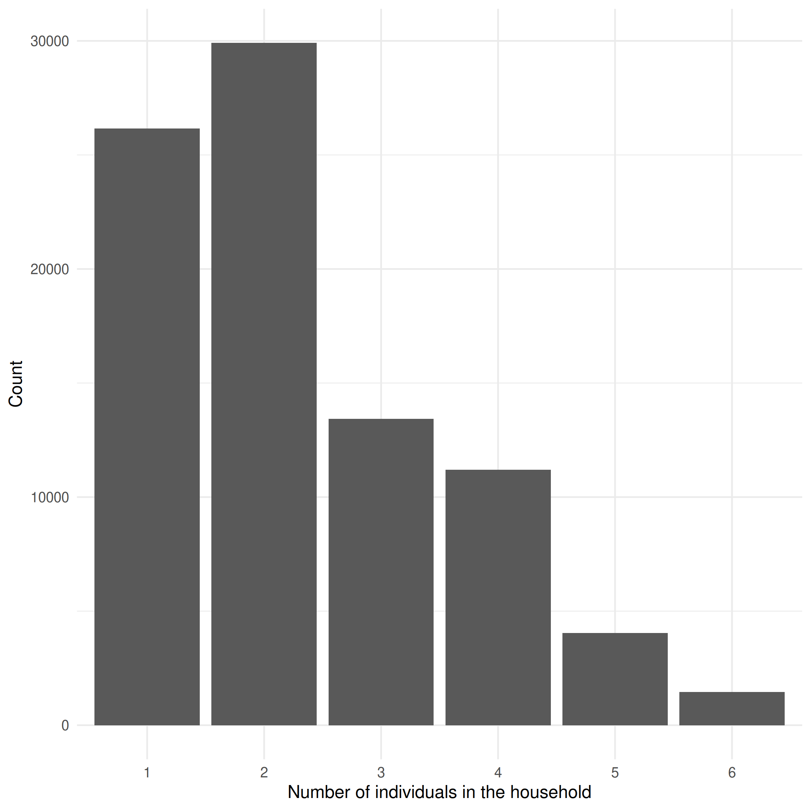

(\#fig:household-size)(ref:household-size)

(ref:age) Age group sizes follow from the household sampling procedure.

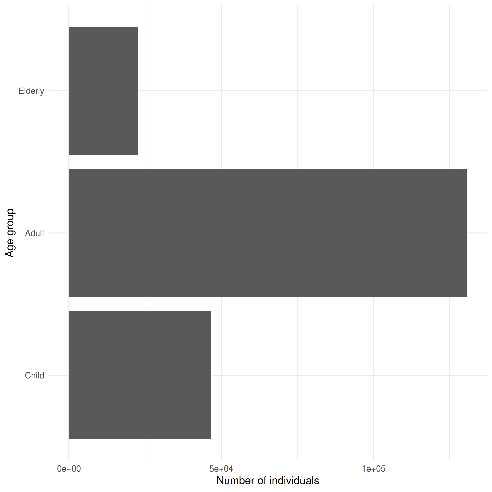

(\#fig:age)(ref:age)

2.  **Schools** All children are assumed to attend school. The number of students in each school (Figure \@ref(fig:school-size)) is sampled from the 2022/2023 census of schools in the UK [@school2023], with children then assigned randomly to each school. A small number of adults also attend schools (rather than workplaces) to reflect educational staff such as teachers. For each 20 students, there is one adult teacher who works at the school (this is based on UK Office of National Statistics Data). School assignment is **static** - for each individual, the particular school they are assigned to is fixed and does not change across the course of a single simulation. They visit the same school each day.

(ref:school-size) The distribution of school sizes.

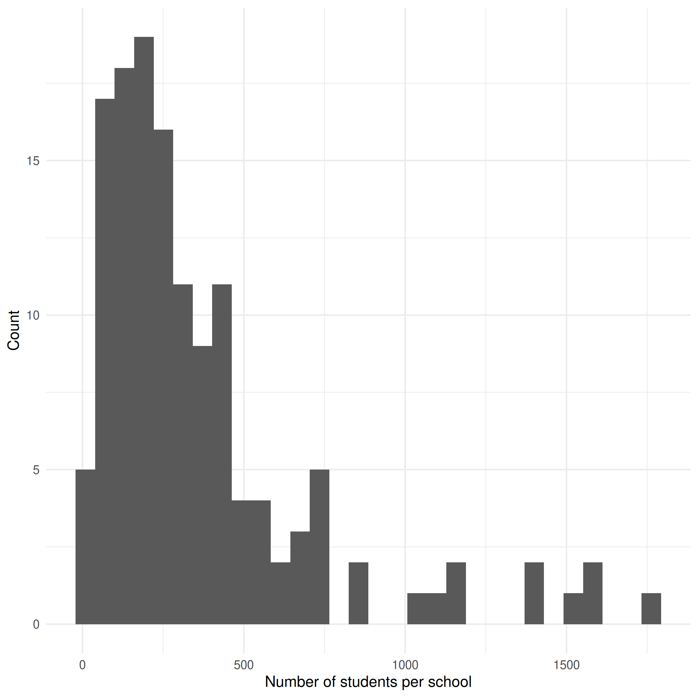

(\#fig:school-size)(ref:school-size)

3.  **Workplaces** All adults (who are not teachers) are assumed to attend workplaces. The number of employees in each workplace (Figure \@ref(fig:workplace-size)) is sampled from an offset truncated power statistical distribution, based on that of @ferguson2005strategies which in turn is based on data from the United States of America. Adults are assigned randomly to each of these workplaces. Workplace assignment is **static** - for each individual, the particular workplace they are assigned to is fixed and does not change across the course of a single simulation. They visit the same workplace each day.

(ref:workplace-size) The distribution of workplace sizes. Here, size is shown on a logarithimic scale.

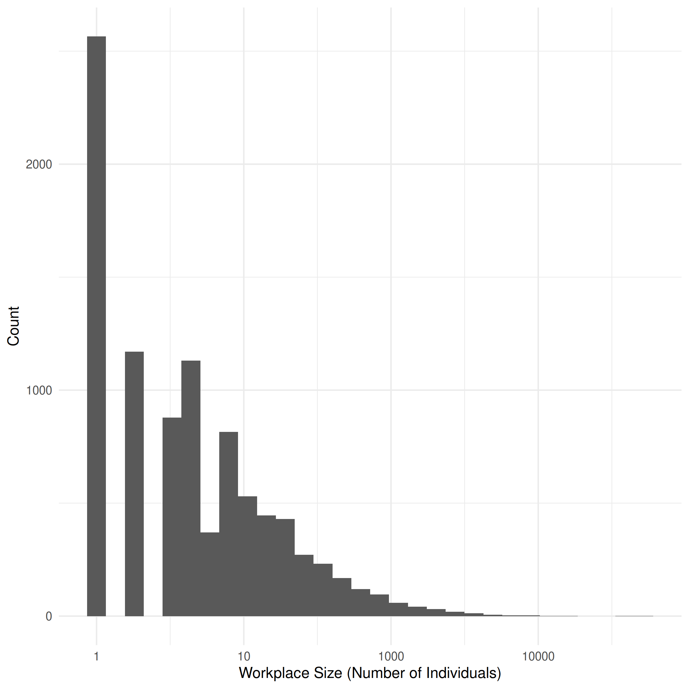

(\#fig:workplace-size)(ref:workplace-size)

4.  **Leisure venues** All individuals (children, adults, and elderly people) are eligible to attend leisure venues. Leisure venue sizes are sampled from a negative binomial distribution, which determines their maximum occupancy. Leisure venue assignment is **dynamic** - for each individual, the particular leisure venue they are assigned to is dynamic and changes across the course of a single simulation. They visit a different leisure venue each day (and sometimes do not visit any leisure venues on a given day), with the number of leisure venues visited by each individual per week (Figure \@ref(fig:leisure-venues)) sampled from a Poisson distribution, capped at seven corresponding to one leisure visit each day. The particular leisure venue they visit is drawn from a short individual-specific list of potential leisure venues that is determined randomly.

(ref:leisure-venues) The number of leisure venues that each individual attends in a week. The minimum possible number of venues is zero, and maximum possible is seven.

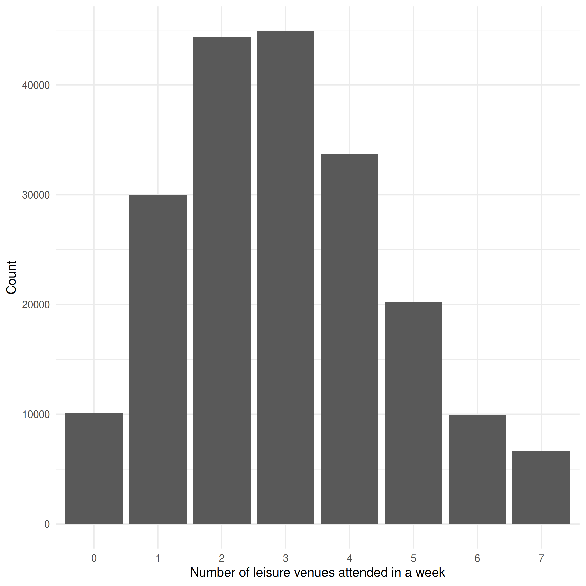

(\#fig:leisure-venues)(ref:leisure-venues)

## Disease States & The Infection Process {#disease}

Individuals exist in one of four different disease states:

-   **Susceptible:** They are susceptible to infection by the pathogen.

-   **Exposed:** They have been infected but are not currently infectious (often known as the pathogen's *"incubation period"*).

-   **Infectious:** They are infectious and can infect other individuals.

-   **Recovered:** They are no longer infectious and are immune to future infection.

At any timepoint, each individual is either susceptible, exposed, infectious, or recovered. Individuals are infected (S -\> E) after spending time in the same location as infectious individuals. For each individual we calculate a location-specific force of infection, which determines the probability they are infected in a given timestep. Specifically, the force of infection experienced by individual $i$ in Location $m$ at time $t$ is calculated as follows:

$$
\lambda_{i,m}(t) = \frac{\beta_{m} I_m(t)}{N_m}
$$

where $I_m(t)$ are the number of infectious individuals in Location $m$ at time $t$ , $N_m$ are the total number of individuals visiting Location $m$ at time $t$ and $\beta_m$ is a location specific (i.e. workplace, school, household, leisure-venue) transmissibility parameter that integrates consideration of both the ***amount of time spent in a location*** and ***the inherent "riskiness"*** **of a location** (i.e. how receptive to onwards transmission it is). Currently within the model, each Location Type (i.e. workplace, school, household, leisure-venue) has a specific $\beta$ (i.e. $\beta_{W}$,$\beta_{S}$ , $\beta_{H}$, $\beta_{L}$ respectively) and all individual locations within a Location Type (e.g. all schools) have the same $\beta$ (though this could be changed in future versions).

The total force of infection $\lambda_T$ for each individual is calculated as a sum of household, workplace, school and leisure force of infections. We add an additional force of infection term $\lambda_C$ to represent types of potential infectious contacts not represented by the locations we consider (e.g. during a commute to/from a workplace, grocery shopping etc). and which represents general mixing among all people. The total Force of Infection experienced by individual $i$ is therefore calculated as:

$$ \lambda_{i, T} = \lambda_{i, H} + \lambda_{i, W} + \lambda_{i, S} + \lambda_{i, L} + \lambda_{i, C} $$

The probability of individual $i$ becoming infected during one time-step $t$ is calculated by summing the Location-specific force of infections they experience and then calculating the following:

$$
P(infection) = 1 - \exp(- \lambda_{i,T}t).
$$

Exposed individuals become infectious after some delay (the *incubation period*). Infectious individuals recover after some delay (the *duration of infectiousness*). After recovering, individuals can then return to being susceptible (reflecting the loss of acquired immunity to infection), again after some delay. By altering the duration of acquired immunity to infection, the framework has the capacity to simulate both epidemic (those producing a single "epidemic wave" before dying out) and endemic (those which are constantly present in the population) pathogens (Figure \@ref(fig:epidemic-endemic)).

(ref:epidemic-endemic) Illustration of simulated epidemic and endemic pathogens.

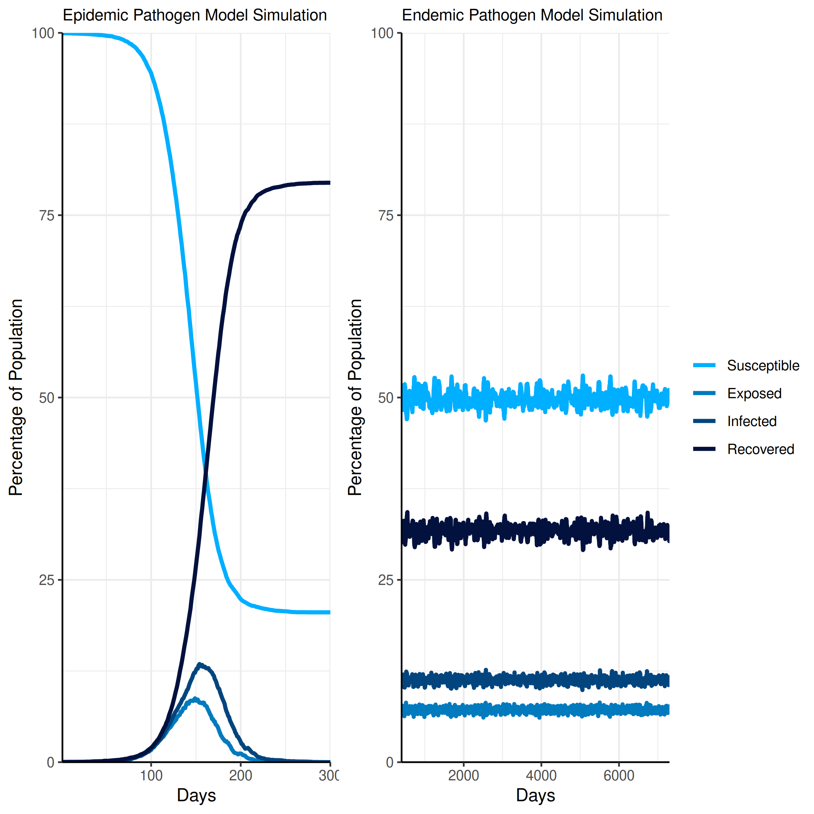

(\#fig:epidemic-endemic)(ref:epidemic-endemic)

## Modelling Far UVC

Far UVC interventions can be installed in each of the four location types, in any combination (i.e. in either one, two, three, or all four location types). We model the efficacy of far UVC as the reduction in the force of infection an individual experiences in a location where it is installed. Specifically, the force of infection experienced by individual $i$ in Location $m$ at time $t$ where far UVC is installed is calculated as follows:

$$
\lambda_{i,m}(t) = (1 - E_{UVC})\frac{\beta_{m} I_m(t)}{N_m}
$$

where $E_{UVC}$ is the efficacy of far UVC. For example, an efficacy of 50% results in a reduction of the force of infection an individual experiences in that particular location by a half. The efficacy of far UVC within each particular Location Type (i.e. schools, workplaces, leisure venues) can be set individually (i.e. to produce a Location-Type specific efficacy.)

Within each Location Type, the proportion of locations covered by the installation can also be specified. Given a certain level of coverage (e.g. 20%), the settings with far UVC installed can be set according to one of two **coverage strategies**:

-   **Random:** Locations for far UVC to be installed are sampled at random, with a random 20% of locations of that type selected.

-   **Targeted:** Locations for far UVC to be installed are chosen in order of size, with the largest 20% of locations selected to receive far UVC.

Figure \@ref(fig:uvc) provides an example illustrating the difference between these two strategies as applied to the schools Location Type.

(ref:uvc) Illustration of the targeted and random strategies for the workplace Location Type.

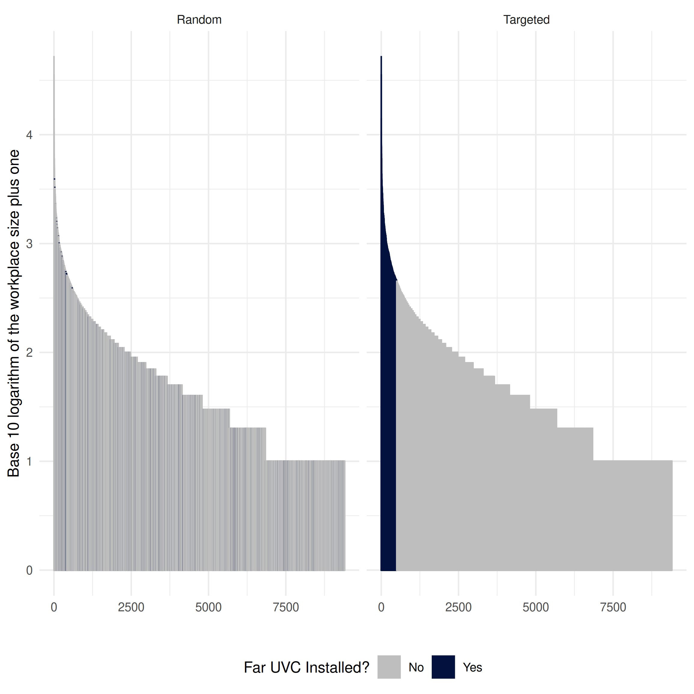

(\#fig:uvc)(ref:uvc)

# Illustrative Simulations of Far UVC

What follows is a demonstration of the types of model outputs that `helios` can generate, and how these outputs can be presented graphically. To do this, we have carried out two sets of analyses using the modelling framework to investigate the following:

1.  Comparison of random and targeted far UVC deployment under different epidemic pathogen outbreak scenarios
2.  The impact of far UVC efficacy, coverage and deployment strategy on epidemic final size (i.e. total number of individuals infected) during epidemic pathogen outbreak scenarios

**The results presented in these figures are illustrative and primarily meant to demonstrate the types of result that the framework can currently produce. They should not be over-interpreted at this early stage, and we note that they will be subject to substantial change following your input, and throughout the model development phase.**

## Exploring the impact of far UVC deployment strategies on disease dynamics with `helios`

To assess the potential of far UVC deployment to mitigate transmission, we carried out a number of simulations for a pathogen with characteristics approximately similar to SARS-CoV-2 (R0 of 2), and explored the impact of far UVC on transmission dynamics. Specifically, we compared the transmission dynamics under a no-intervention baseline, random far UVC deployment, and far UVC deployment targeted at the most populous 50% of places within each setting type.

These comparisons were performed for both epidemic and endemic pathogens. For epidemic pathogens, we assume that infection by the pathogen confers full and lasting immunity. For endemic pathogens, we assume that immunity following infection with the pathogen is short lived, and wanes. We assumed far UVC efficacy was sufficient to reduce transmission intensity by 75%, and that coverage of far UVC (i.e. the proportion of locations with far UVC installed) was 50%. Further, we assume a 30%\|30%\|30%\|10% split in where transmission takes place (households, workplace/school, leisure venue and in the community, respectively).

### Epidemic Pathogen Simulation

Figure \@ref(fig:exemplar-epidemic) shows the effect of random and targeted far UVC deployment, relative to an interventionless baseline, on the disease state dynamics of an epidemic pathogen. Random indicates that far UVC was assigned to a random 50% of school, workplace and leisure locations. Targeted indicates that far UVC was assigned to the largest 50% of school, workplace and leisure locations.

In the epidemic scenario, having pre-installed far UVC devices in the workplace, school, and leisure settings reduced the number of people who become infected by the pathogen and, when targeted specifically to the most largest settings within a setting type (the "Targeted" strategy), slowed the rate of pathogen spread in the population. Targeted far UVC provided an even greater reduction in the total number of people infected relative to the random deployment than random far UVC deployment provided relative to the no-intervention baseline.

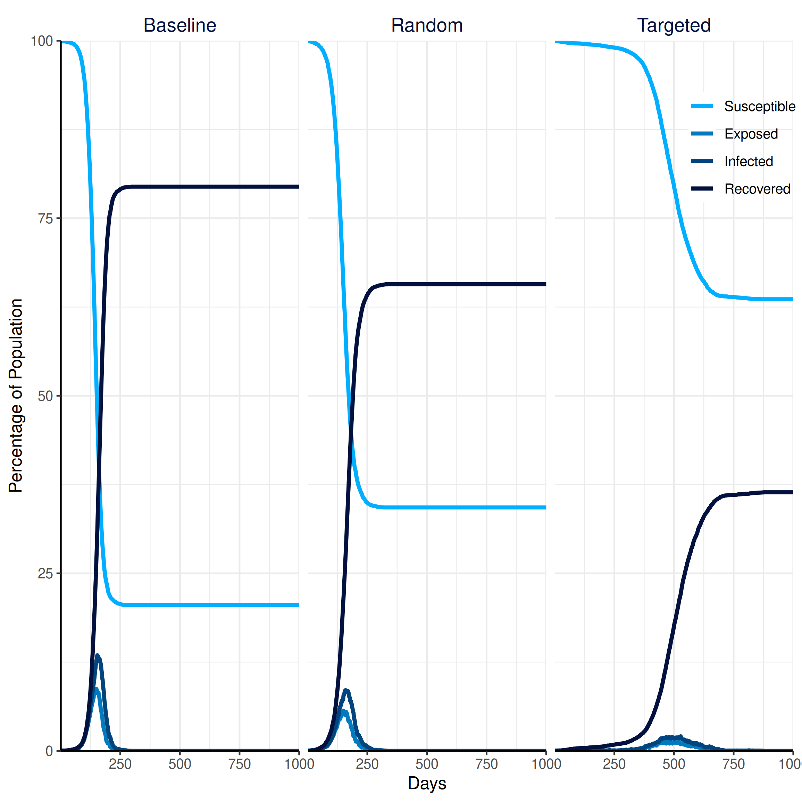

(\#fig:exemplar-epidemic)(ref:exemplar-epidemic)

(ref:exemplar-epidemic) Illustration of the effect of random and targeted far UVC deployment, relative to an interventionless baseline, on the disease state dynamics of a theoretical pathogen when full and lasting immunity to infection is acquired by infected individuals (i.e. the pathogen induces a single epidemic).

### Endemic Pathogen Simulation

Figure \@ref(fig:exemplar-endemic) shows the effect of random and targeted far UVC deployment, relative to an interventionless baseline, on the disease state dynamics of a theoretical pathogen, when the immunity acquired during infection wanes over time. Random indicates that far UVC was assigned to a random 50% of school, workplace and leisure locations. Targeted indicates that far UVC was assigned to the largest 50% of school, workplace and leisure locations.

In the endemic scenario, where a pathogen is already established in the human population, introducing far UVC decreased the proportion of individuals in the population with infections relative to the no-intervention baseline scenario (Figure \@ref(fig:exemplar-endemic)). Again, targeting far UVC deployment provided additional benefits to pathogen suppression.

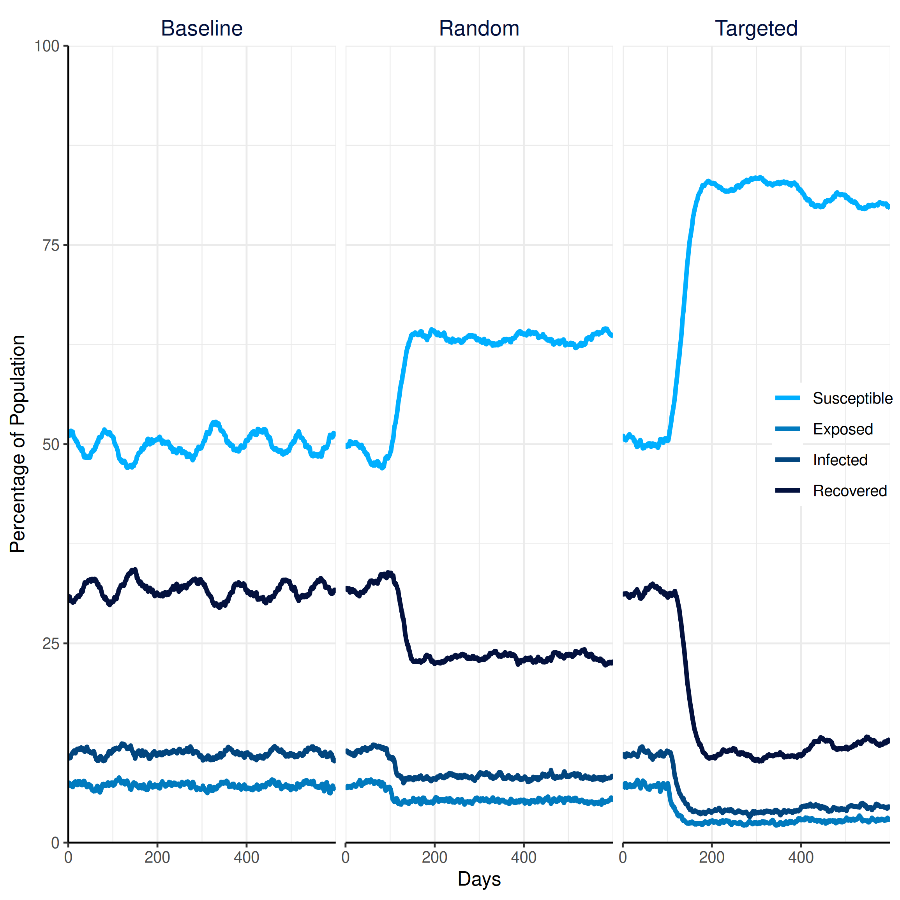

(\#fig:exemplar-endemic)(ref:exemplar-endemic)

(ref:exemplar-endemic) Illustration of the effect of random and targeted far UVC deployment, relative to an interventionless baseline, on the disease state dynamics of a theoretical pathogen on the disease state dynamics of a theoretical pathogen, when the immunity acquired during infection wanes over time (i.e. the pathogen exists in an endemic state).

## Assessing how various far UVC parameters shape epidemic final size

In addition to the outputs presented above (which show the results of a single simulation with a single parameter set), we can also use `helios` framework to explore how key outputs (the total number of individuals infected) varies with changes to input parameters. This is known as a "sensitivity analysis" and we present illustrative results from an example sensitivity analysis below.

We simulated an epidemic (infection with the pathogen confers full and lasting immunity) with varying levels of transmission intensity (R0) and assessed the sensitivity of final epidemic size (defined as the total proportion of the population that gets infected during the course of an epidemic) to variation in far UVC coverage, far UVC efficacy, and deployment strategy (Targeted or Random).

Figures \@ref(fig:sweep-R0-coverage) and \@ref(fig:sweep-R0-efficacy) illustrate how `helios` model outputs can be graphed, depicting how the final epidemic size changes with R0, far UVC coverage, far UVC efficacy, and far UVC deployment strategy. In general, for a given transmission intensity (R0), increasing the coverage (Figure \@ref(fig:sweep-R0-coverage)) or efficacy (Figures \@ref(fig:sweep-R0-efficacy)) of far UVC reduced the final size of the epidemic.

For low transmission intensities (R0 $\leq$ 1.5), very high levels of far UVC coverage and/or prevented the epidemic from occurring (final epidemic size \~0%). Across the majority of combinations of R0, far UVC coverage, and far UVC efficacy, targeting the deployment of far UVC to the most populous settings achieved a greater reduction in final epidemic size.

### Sensitivity Analysis of R0 & far UVC Coverage

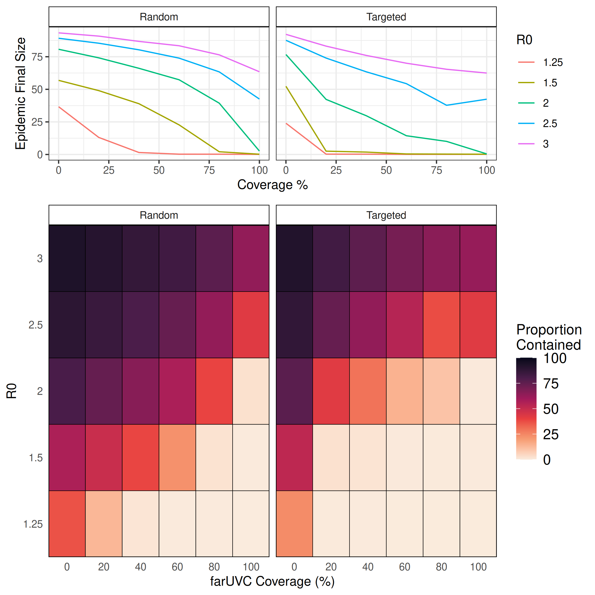

(\#fig:sweep-R0-coverage)(ref:sweep-R0-coverage)

(ref:sweep-R0-coverage) The effect of R0 and far UVC efficacy, under random and targeted far UVC deployment, on the proportion of the population that a pathogen infects assuming a far UVC efficacy of 80%.

### Sensitivity Analysis of R0 & far UVC Efficacy

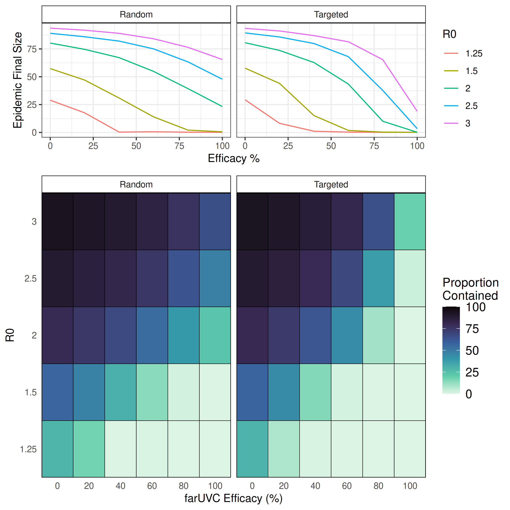

(\#fig:sweep-R0-efficacy)(ref:sweep-R0-efficacy)

(ref:sweep-R0-efficacy) The effect of R0 and far UVC efficacy, under random and targeted far UVC deployment, on the proportion of the population that a pathogen infects assuming a far UVC coverage of 80% is achieved.

# Bibliography {.unnumbered}
